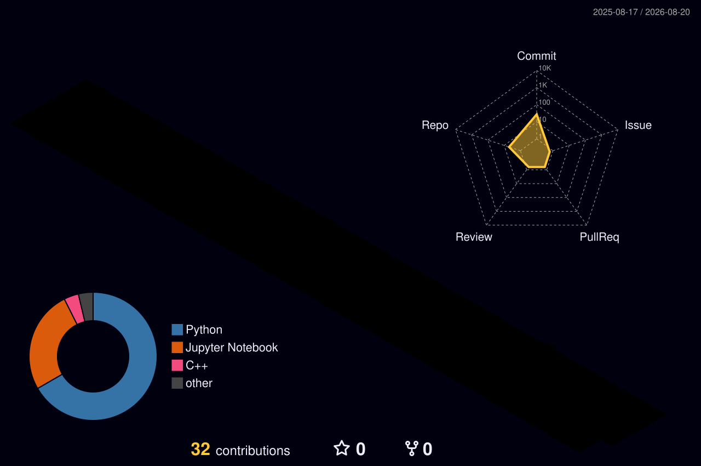

## 👋 Hey, I'm Kanishka

> Just me trying to work more consistently on my projects.

## Today's Goal

**Build Your Own Claude Code — Next Stage**

> Study the tool-calling flow and make meaningful progress.

## GitHub Metrics

### 🔥 Streak

  

### GitHub Stats

  

### Languages

## Contributions

### Keep building. Keep learning. 🚀

