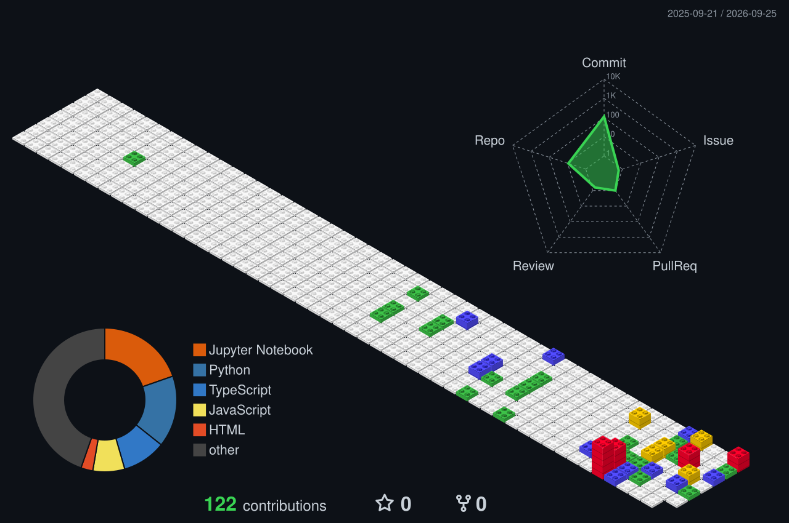

## 👋 Hey, I'm Kanishka

> I'm a Computer Science student interested in AI, Data Science, software development, and quantum computing. I enjoy building projects, solving problems, and learning new technologies. 

### Today's Goal

**Claude Code Project**

> Study the tool-calling flow and make meaningful progress.

## GitHub Metrics

### Streak

### Contributions

